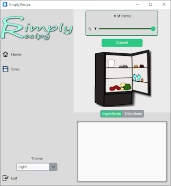
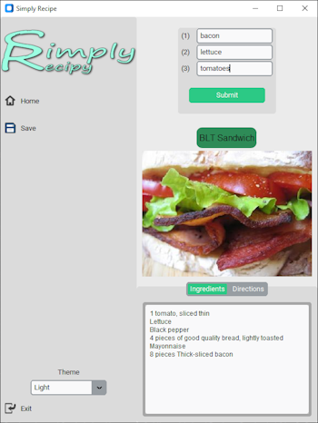

## Description: 🍖
This is a simple recipe book using [Spoonaculars](https://spoonacular.com/food-api) database and coded entirely 
in Python.

## Usage: 🍔
#### Step 1:
> First you need to obtain an API key from
> [Spoonacular.com](https://spoonacular.com/food-api/console#Dashboard) and create an account
> 
> After obtaining the key store it in .env as `api_key = "put_key_here"` in the main directory
#### Step 2:
>Start the Program. Choose up to 5 ingredients and click submit.
#### Step 3:
>Enter the items to include in the recipe. The program will try and find a recipe with the listed ingredients. 
#### Step 4:
>Option to save recipes are stored as a `.txt` file which are saved in the same directory as the program.

There are hundreds if not thousands of combinations so think of your favorite foods and enjoy. 😁

## Video Demo: 🎥

# Dependencies:

Important ones are `customtkinter` for GUI and `PIL` for loading images.

`dotenv` for api key and `ratelimit` for throttling calls.
* **Tkinter is a standard GUI library built into Python**
* **Simply Recipe utilizes customtkinter which is a relatively new and modified version of Tkinter but with a more modern look.**

###### Disclaimer
* Assets aside from recipes are created by me.
* Recipe and data are all owned and distributed by [Spoonacular](https://spoonacular.com/food-api)
* I am in no way endorsed or affiliated with Spoonacular.
